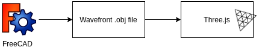

# OpenAFPM CAD Visualization

Module for visualizing [openafpm-cad-core](https://github.com/gbroques/openafpm-cad-core) 3D wind turbine model created in [FreeCAD](https://freecadweb.org/https://freecadweb.org/) via a [web browser](https://en.wikipedia.org/wiki/Web_browser).

1. Create the 3D model in [FreeCAD](https://freecadweb.org/https://freecadweb.org/).
2. Export the 3D model to [Wavefront OBJ](https://en.wikipedia.org/wiki/Wavefront_.obj_file) (`.obj`) format.
3. Load the 3D model (`.obj` file) with [three.js](https://threejs.org/).

## Prerequisites
Install [Node.js](https://nodejs.org/en/).

## How to Run
1. Install dependencies.

       npm install

2. (**OPTIONAL**) Build bundle if you want to make changes to files in `src/`.

       npm run watch

3. Start server.

       npm run serve

4. Navigate to http://127.0.0.1:8080/ in your web browser of choice. Currently tested in Chrome.

Additionally, on UNIX-like operating systems, you can run `npm start`; which runs `npm run watch` and `npm run serve` in parallel.

## Object Names

A list of object names that **MUST** be present in the `.obj` file.

In the [Wavefront .obj format](https://en.wikipedia.org/wiki/Wavefront_.obj_file), object names start with `o` and are delimited with a space on their own line (e.g. `o Coils`). 

1. Coils
2. StatorResinCast
3. FrontRotorDisk
4. FrontRotorResinCast
5. FrontMagnets
6. BackRotorDisk
7. BackRotorResinCast
8. BackMagnets
9. Flange
10. RotorSideFlangeCover
11. FrameSideFlangeCover
12. StubAxleShaft
13. HubThreads
14. Frame
15. YawBearing
16. TailBoom
17. TailVane
18. TailHinge
19. StatorMountingStuds

## API

### OpenAfpmCadVisualization

#### Constructor

Construct a new OpenAFPM CAD visualization instance.

##### Arguments

|Name|Type|Required|Description|
|----|----|--------|-----------|
|`options`|`Object`|`true`|See below rows documenting properties.|
|`options.objUrl`|`string`|`true`|URL to load [Wavefront OBJ](https://en.wikipedia.org/wiki/Wavefront_.obj_file) file.|
|`options.rootDomElement`|[`Element`](https://developer.mozilla.org/en-US/docs/Web/API/Element)|`true`|DOM element to mount visualization elements to.|
|`options.width`|`number`|`true`|Width of visualization.|
|`options.height`|`number`|`true`|Height of visualization.|

#### resize(width, height)
Resize visualization to specified `width` and `height`.

##### Arguments

|Name|Type|Required|Description|
|----|----|--------|-----------|
|`width`|`number`|`true`|Width to resize visualization to.|
|`height`|`number`|`true`|Height to resize visualization to.|

**Returns:** `undefined`

#### handleMouseMove(event)
Display tooltip if cursor hovers over part and update internal mouse coordinates.

This method is debounced with a 10 millisecond wait time.

##### Arguments

|Name|Type|Required|Description|
|----|----|--------|-----------|
|`event`|[`MouseEvent`](https://developer.mozilla.org/en-US/docs/Web/API/MouseEvent)|`true`|[mousemove event](https://developer.mozilla.org/en-US/docs/Web/API/Element/mousemove_event).|

**Returns:** `undefined`

#### cleanUp()
Performs various clean-up such as [disposing geometries and materials](https://threejs.org/docs/#manual/en/introduction/How-to-dispose-of-objects).

**Returns:** `undefined`

## Related Repositories

* [openafpm-cad-core](https://github.com/gbroques/openafpm-cad-core)
